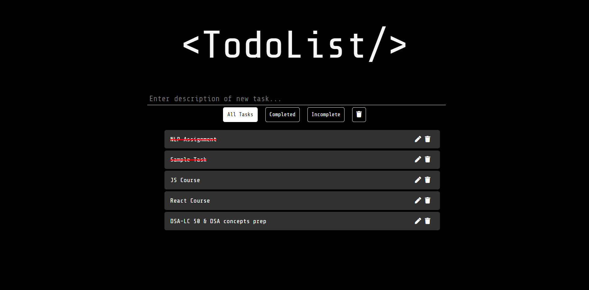
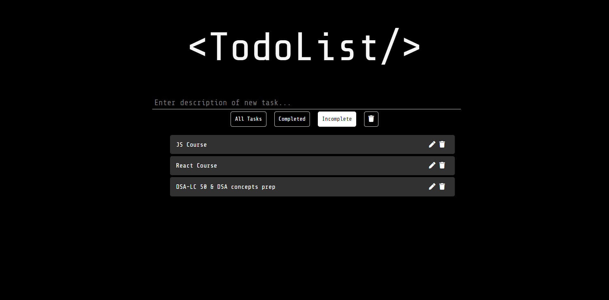
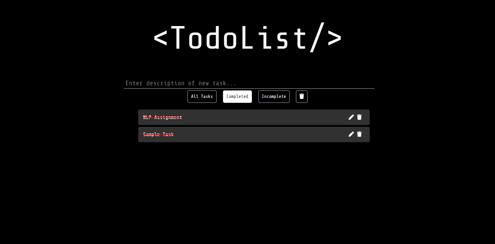

A simple to-do list app developed using React JS library and uses Redux for state management.

Here are some screenshots of the final result :

 All Tasks Tab  

 Incomplete Tasks Tab  

 Completed Tasks Tab  
